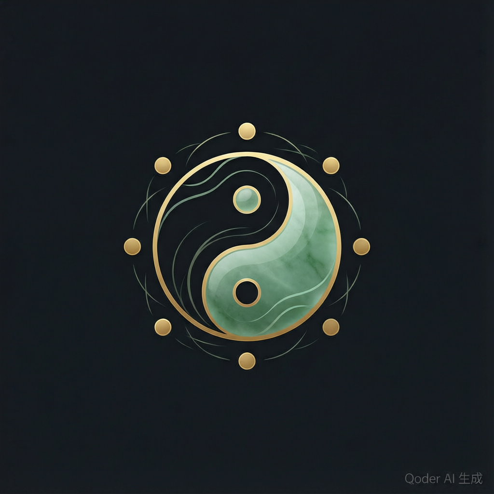

<p align="center">
  
</p>

<h1 align="center">WuYun-LiuQi Skills</h1>
<h3 align="center">五运六气 AI Agent 技能包</h3>

<p align="center"><em style="font-family: &quot;KaiTi&quot;, &quot;STKaiti&quot;, &quot;SimSun&quot;, serif; font-size: 1.3em; color: #999;">天人合一，五运六气</em></p>

<p align="center">帮助人类通过 AI Agent 理解《黄帝内经》运气学思想的技能包<br/>
AI Agent Skill Pack that enables humans to deeply understand WuYun-LiuQi (Five Movements and Six Qi) philosophy through natural conversation</p>

<p align="center">TCM Climate &amp; Pathology Engine — Ganzhi calculation · Six-Qi progression · RAG knowledge base · ReAct reasoning · Self-evolving<br/>
中医运气学推算引擎 — 干支推算 · 六气步移 · 五层 RAG 知识库 · ReAct 推理 · 自进化引擎</p>

<p align="center">
  <a href="https://github.com/dhicoc/wuyun-liuqi-skills/stargazers"></a>
  <a href="https://github.com/dhicoc/wuyun-liuqi-skills/forks"></a>
  <a href="https://github.com/dhicoc/wuyun-liuqi-skills/issues"></a>
  <a href="LICENSE"></a>
</p>

<br/>

<p align="center">
  <a href="#关于项目">关于</a> ·
  <a href="#快速开始">快速开始</a> ·
  <a href="README_AI.md">AI 引导</a> ·
  <a href="#使用说明">使用说明</a> ·
  <a href="#架构设计">架构设计</a> ·
  <a href="#贡献">贡献</a> ·
  <a href="#许可证">许可证</a>
</p>

<p align="center">
  🌐 <a href="#english-version">English</a>
</p>

<br/>

<a id="关于项目"></a>

## 关于项目

> **如果你是 AI Agent，直接跳转到 [README_AI.md](README_AI.md)，严格按照内容要求执行。**

**核心定位**：人类将本技能包安装到自己的 AI Agent（Claude、Cursor 等）中后，Agent 就能成为一个可靠的“五运六气思想讲解员”和推算助手，帮助人类准确、系统地理解《黄帝内经》运气学这个古老而深刻的思想体系。

基于中医运气学说（《黄帝内经》素问七篇大论），本技能包让 AI Agent 能够：
- 进行严谨的干支运气推算（而非凭记忆或幻觉）
- 检索并运用结构化的经典知识（RAG）
- 按照正确的思维路径进行辨证推理
- 输出可学习的报告、解释和个人化参考

```
人类提问（关于运气） → Agent 激活本技能 → 推算引擎 + RAG 知识库 → 病机分析 + 思想解读 → 结构化报告 + 自进化
```

**为什么需要这个项目：**
- 五运六气思想体系复杂（大量数据表、严谨规则、分散在经典中），普通人难以系统掌握
- 一般大模型容易对干支、司天在泉、客主加临等内容产生幻觉或简化错误
- 人类需要一个能“教”而不是“猜”的助手，来真正理解运气学背后的宇宙观、时间观与生命观
- 缺乏专为 Agent 设计的、可靠的运气学知识与计算技能包

本技能包正是为了解决以上问题，让人类通过与 AI 的自然对话，深入了解五运六气这个思想。

完整路由（单一真相源）：[routing.yaml](routing.yaml) · 人类索引：[routing.md](routing.md)

<p align="right">(<a href="#关于项目">返回顶部</a>)</p>

### 技术栈

<p align="left">
  <br/>
  <code>lunar-python</code> · <code>lunar-javascript</code> · <code>RAG</code> · <code>ReAct</code>
</p>

<p align="right">(<a href="#关于项目">返回顶部</a>)</p>

<a id="快速开始"></a>

## 快速开始

### 前置依赖

- **Python 3.8+** — 推荐安装 `lunar-python`（精确节气计算）
- **Node.js 14+** — JS 版需要安装 `lunar-javascript`
- **代码 AI 客户端** — Claude Code、Codex CLI、Cursor 等

### 安装

```
git clone https://github.com/dhicoc/wuyun-liuqi-skills.git
cd wuyun-liuqi-skills
```

### 快速配置（人类用户）—— 支持直接丢仓库地址

**最推荐的方式（接近一句话安装）：**

直接把下面内容复制给 Claude（或其他 AI）：

```
仓库地址：https://github.com/dhicoc/wuyun-liuqi-skills.git

请按 workflows/one-line-install.md 帮我把这个五运六气技能包完整安装好：
克隆仓库、运行 `python scripts/install.py --link-global`、验证通过。
```

AI 会完成：克隆 → `install.py --link-global`（自动注册全局技能）→ 验证。之后你在任意项目里说「五运六气」即可激活。

---

传统方式：

1. 把本技能包放在你的 AI Agent 能访问的位置。
2. 让 Agent 准备好运行环境：

```bash
# Windows (PowerShell/cmd)
scripts\setup.bat

# Linux/macOS
bash scripts/setup.sh
```

配置完成后，在与 Agent 的对话中直接说“五运六气”“今天运气怎么样”“帮我分析出生年份的运气”等，Agent 会自动使用本技能来帮助你理解这个思想。

### 跨工具薄壳（自动发现）

克隆本仓库到 Agent 可访问的位置后，以下入口文件会自动引导到 `SKILL.md` 与 `routing.yaml`：

| 工具 | 入口文件 |
|------|----------|
| Codex / Copilot / OpenCode | [AGENTS.md](AGENTS.md) |
| Claude Code | [CLAUDE.md](CLAUDE.md) + 可选 [.claude/skills/wuyun-liuqi/](.claude/skills/wuyun-liuqi/) |
| Codex 兼容镜像 | [CODEX.md](CODEX.md) |
| Gemini CLI | [GEMINI.md](GEMINI.md) |
| Cursor | [.cursor/rules/wuyun-liuqi.mdc](.cursor/rules/wuyun-liuqi.mdc) + [.cursor/skills/wuyun-liuqi/SKILL.md](.cursor/skills/wuyun-liuqi/SKILL.md) |

**一句话安装后的两种激活方式：**

| 场景 | 做法 | 适合 |
|------|------|------|
| A. 在本仓库用 | 用 Cursor/Claude **打开** `wuyun-liuqi-skills` 文件夹 | 初学、试用 |
| B. 在任意项目用 | `python scripts/install.py --link-global`（自动链接 Claude/Cursor 全局技能目录） | 日常常驻（推荐） |

场景 B 下，用户在别的项目里说「五运六气」也会激活；薄壳与 `SKILL.md` 仍在包内，无需手抄规则。详细步骤见 [workflows/one-line-install.md](workflows/one-line-install.md)。

**Claude Code 插件市场（场景 C）：**

```text
/plugin marketplace add dhicoc/wuyun-liuqi-skills
/plugin install wuyun-liuqi-skills@wuyun-liuqi-skills
```

详见 [workflows/claude-plugin-install.md](workflows/claude-plugin-install.md)。

### 技术入口（供 Agent 直接调用或调试）

> **主链路**：`scripts/calculate_yunqi_api.py`（支持 `today` / 默认今天 + 思想层）

```bash
# Agent 常用（快速 + 思想理解）
python scripts/calculate_yunqi_api.py today --summary
python scripts/calculate_yunqi_api.py today --level deep --explain-concept "天人合一"
python scripts/calculate_yunqi_api.py 2026-06-27 --json --export summary

# 导出思想材料
python scripts/export_thought.py today --format all          # 摘要 + 卡片 + HTML/PDF
python scripts/self_evolve.py stats --top-concepts 5
```

### 全链路验证

```bash
python scripts/demo_full_chain.py 2026-06-27
python tests/verify_expansion.py
python tests/full_regression_test.py   # 63 项，通过 0 失败
```

<p align="right">(<a href="#快速开始">返回顶部</a>)</p>

<a id="使用说明"></a>

## 使用说明

### 推荐使用方式

**最自然的方式**：把本技能包安装到你的 AI Agent 中，然后直接用自然语言提问（例如：“五运六气是什么思想？”“今年运气如何影响养生？”“我的出生年份运气和体质有什么关系？”）。

Agent 会自动调用本技能包的推算引擎、知识库和推理流程来帮助你理解运气学这个思想体系。

### 技术级入口（供 Agent 或调试使用）

| 场景 | 推荐入口 |
|------|----------|
| 日期运气快速了解 | `scripts/calculate_yunqi_api.py today --summary`（支持 today / 默认今天） |
| Agent / JSON 接口 | `scripts/calculate_yunqi_api.py <日期> --json` |
| 综合报告（学生/临床/研究版） | `scripts/yunqi_report.py <年份> --audience student\|practitioner\|researcher` |
| 个人出生运气 + 体质 | `scripts/personal_yunqi_profile.py <出生日期> [地区]` |
| 天气 × 运气 × 体质对齐 | `scripts/advanced_alignment.py --date <日期> --city <城市> --mock` |

### 人类常用提问示例（直接对你的 AI 说这些）

**理解思想：**
- "五运六气是什么思想？核心的宇宙观和生命观是什么？"
- "天人合一在运气学里怎么体现？"

**生活应用：**
- "今年运气对养生有什么启发？"
- "最近天气变化，和运气有关系吗？我该注意什么？"

**个人探索：**
- "我出生那年的运气格局，对我的体质或人生阶段有什么思想意义？"
- "请分析我当前运气 + 出生运气的整体思想启发"

**学习深入 / 思想理解：**
- "用简单语言解释司天在泉，然后再给哲学层面的解读"
- "天符和中和这两个概念怎么连起来理解运气学的辩证思想？"
- "请用 --level deep 解释今年格局的思想启发，并导出卡片集帮我复习"

**导出与复习：**
- "帮我导出今年运气的思想摘要和 Anki 卡片"
- "生成可打印的 PDF 思想报告"
| RAG 知识库检索 | `rag-knowledge-base/` |
| 自进化引擎 | `scripts/self_evolve.py` |
| 端到端验证 | `tests/verify_expansion.py` (scripts/ 有兼容 wrapper) |

### 功能覆盖矩阵

| 功能层级 | 覆盖能力 | 主入口 / 文件 | 状态 |
|----------|----------|---------------|------|
| 干支基础 | 年干支、六十甲子序号、生肖 | `scripts/ganzhi_calc.py` | ✅ 已覆盖 |
| 五运推算 | 天干化五运、大运太过/不及、平气判断 | `scripts/dayun_calc.py`、`yunqi-calc/references/taiguo_buji.md` | ✅ 已覆盖 |
| 主运客运 | 主运五步、客运五步、太少推移 | `scripts/keyun_calc.py` | ✅ 已覆盖 |
| 六气推算 | 司天、在泉、主气六步、客气六步 | `scripts/liuqi_calc.py` | ✅ 已覆盖 |
| 客主加临 | 六步客主关系、相得/不相得、顺逆分析 | `scripts/kezhujialin.py` | ✅ 已覆盖 |
| 日期统一接口 | 大寒定年、日干支、当前步位、RAG keys、JSON 输出 | `scripts/calculate_yunqi_api.py` | ✅ Python 主链路 |
| Node.js 接口 | 面向前端/Node 集成的 JSON 输出 | `scripts/calculate_yunqi_api.js` | 🟡 可选接口 |
| 病机分析 | 五运病机、六气病机、太过不及、运气合病 | `yunqi-pathogenesis/` | ✅ 文档化推理 |
| 临床应用 | 治则治法、方药方向、针灸选穴、养生调理 | `yunqi-clinical/` | ✅ 参考建议，含免责声明 |
| 经典文献 | 素问七篇、历代运气学说、现代研究索引 | `yunqi-classics/`、`rag-knowledge-base/asset5_commentary.json` | ✅ 已覆盖 |
| RAG 知识库 | 岁运、司天在泉、客主加临、运气方、注家、地域、体质 | `rag-knowledge-base/asset*.json` | ✅ 已覆盖 |
| 个人体质 | 出生年运气体质倾向、九种体质量表、当前岁运调理方向、地域修正 | `scripts/personal_yunqi_profile.py`、`scripts/constitution_assessment.py`、`advanced-alignment/` | ✅ 已覆盖 |
| 天气对齐 | 实时气象 × 运气格局交叉分析，判断内外邪相合/相背/兼夹 | `scripts/weather_alignment.py`、`advanced-alignment/weather_integration.md` | ✅ 已接入 |
| 天气 × 体质叠加 | 出生运气体质 × 当前岁运 × 天气实况三维分析 | `scripts/yunqi_weather_constitution.py` | ✅ 已接入 |
| 统一高级对齐 | 基础运气、出生运气体质、九种体质量表、天气对齐的统一入口 | `scripts/advanced_alignment.py` | ✅ 已接入 |
| 报告生成 | 学生版、临床版、研究版 Markdown 报告；支持注入高级对齐章节 | `scripts/yunqi_report.py --advanced-json`、`scripts/generate_html_report.py --with-advanced-alignment`、`docs-generator/` | ✅ 已覆盖 |
| 可视化 | 终端 ASCII 图、HTML 可视化报告 | `scripts/visualize_yunqi.py`、`scripts/generate_html_report.py` | ✅ 已覆盖 |
| 自进化 | 使用日志 + 概念/哲学追踪 + 理解反馈 + 隐私哈希/清洗 + 月报 + 清理 + 自动建议 | `scripts/self_evolve.py`、`self-evolve/` | ✅ 已覆盖（含思想理解维度） |
| 校验测试 | 环境检查、知识库校验、端到端测试、全量回归（63/0） | `scripts/health_check.py`、`scripts/validate_knowledge_base.py`、`tests/verify_expansion.py`、`tests/full_regression_test.py` | ✅ 已覆盖 |
| 思想导出 | 纯文本思想摘要、Anki 卡片集、高质量 HTML/打印 PDF | `scripts/export_thought.py` / `calculate_yunqi_api.py --export` | ✅ 新增 |

> 注：临床、方药、针灸相关内容仅作为中医运气学理论参考，不构成医学诊断或治疗建议；具体诊疗须由执业医师辨证处理。

### 关键文件

| 文件 | 用途 |
|------|------|
| [SKILL.md](SKILL.md) | 总控路由入口（AI 必读） |
| [routing.yaml](routing.yaml) | 路由单一真相源 |
| [routing.md](routing.md) | 路由人类可读索引 |
| [AGENTS.md](AGENTS.md) / [CLAUDE.md](CLAUDE.md) | 跨工具薄壳 |
| [workflows/routing-contract.md](workflows/routing-contract.md) | 路由执行契约 |
| [RULES.md](RULES.md) | 行为规则索引 → `rules/` |
| [references/gotchas.md](references/gotchas.md) | 常见踩坑 |
| [workflows/task-closure.md](workflows/task-closure.md) | 任务闭环 |
| [agent-workflow/react_workflow.md](agent-workflow/react_workflow.md) | ReAct 推理工作流规范 |

### 仓库结构

```
.
├── README.md                   # 本文件
├── SKILL.md                    # 总控路由入口
├── routing.yaml                # 路由单一真相源
├── routing.md                  # 路由人类索引
├── AGENTS.md / CLAUDE.md       # 跨工具薄壳
├── CODEX.md / GEMINI.md        # Codex / Gemini 薄壳
├── .claude-plugin/             # Claude Code 插件清单（P2）
├── .cursor/skills/wuyun-liuqi/ # Cursor 技能注册
├── .cursor/rules/              # Cursor 规则薄壳
├── workflows/                  # bootstrap、routing-contract、task-closure
├── rules/                      # medical-safety、calculation、agent-behavior、output
├── references/                 # script-index、module-index、gotchas
├── RULES.md                    # 行为规则索引
├── CONTRIBUTING.md             # 新增子技能指南
├── LICENSE                     # MIT 许可证
│
├── scripts/                    # 推算引擎（Python 主链路 + JS 可选接口）
│   ├── calculate_yunqi_api.py  # ★ Python 主链路统一计算接口
│   ├── weather_alignment.py    # ★ 天气实况 × 运气格局高级对齐
│   ├── constitution_assessment.py # ★ 九种体质量表评估
│   ├── yunqi_weather_constitution.py # ★ 天气 × 体质三维叠加分析
│   ├── advanced_alignment.py   # ★ 高级对齐统一入口
│   ├── calculate_yunqi_api.js  # JS / Node.js 可选接口
│   ├── self_evolve.py          # ★ 自进化引擎（含 rule-gap）
│   ├── check_skill_structure.py # P1 技能结构校验
│   ├── check_routing_scenarios.py # P2 Agent 路由场景测试
│   ├── sync_routing.py           # P3 routing.yaml → SKILL/routing 同步
│   ├── check_conformance.py      # P3 内容一致性
│   ├── audit_orphans.py          # P3 内容层孤儿审计
│   ├── verify_expansion.py     # 兼容入口 → tests/verify_expansion.py
│   └── full_regression_test.py # 兼容入口 → tests/full_regression_test.py
│
├── tests/                      # 测试脚本与夹具
├── reports/                    # 报告与可视化输出
│   ├── examples/               # 标准输出样例、示例报告与预览图
│   ├── generated/              # 本地生成报告（默认忽略）
│   └── test-results/           # 测试输出（默认忽略）
├── rag-knowledge-base/         # ★ RAG 知识库（含 README 与 index.json）
├── .github/workflows/          # CI 工作流
├── agent-workflow/             # ★ ReAct 推理工作流
├── prompts/                    # System Prompt
├── advanced-alignment/         # 高级对齐（天气 / 体质）
├── self-evolve/                # 自进化运行时
│
├── ganzhi-basics/              # 子技能：干支基础
├── yunqi-calc/                 # 子技能：运气推算（核心）
├── yunqi-pathogenesis/         # 子技能：病机分析
├── yunqi-clinical/             # 子技能：临床应用
├── yunqi-classics/             # 子技能：经典文献
├── docs-generator/             # 子技能：报告生成
├── docs/                       # 技术文档
└── case-journal/               # 医案沉淀系统
    └── examples/               # 脱敏示例案例库
```

<p align="right">(<a href="#使用说明">返回顶部</a>)</p>

<a id="架构设计"></a>

## 架构设计

### 五层 RAG 知识库

| 层 | Asset | 条目数 | 用途 |
|----|-------|--------|------|
| 经典病机 | asset1-3 | 52 | 岁运/司天/客主加临病机 |
| 运气方剂 | asset4 | 16 | 三因司天方 |
| 历代注家 | asset5 | 20 | 王冰到陆懋修 11 位医家 |
| 地域修正 | asset6 | 8 | 八大气候区 |
| 运气体质 | asset7 | 18 | 9 种体质 x 岁运 |

**104 个唯一键**覆盖五层，通过 `rag_keys` 精确匹配。

### Agent 集成层

1. **强规则计算工具**（`calculate_yunqi_api`）：大寒定年 + 标准化 JSON + rag_key 生成
2. **RAG 知识库**（`rag-knowledge-base/`）：5 层 key-value 结构化存储
3. **ReAct 推理工作流**（`agent-workflow/`）：查工具 -> 查知识库 -> 辨证推理闭环
4. **System Prompt**（`prompts/`）：TCM 运气专家角色约束
5. **高级对齐**（`advanced-alignment/`）：天气 API 对齐 + 体质交叉分析
6. **自进化回路**（`self_evolve/`）：自动记录 -> 盲区检测 -> 反馈采集 -> 优化报告

### ReAct 推理路径

```
prompts/system_prompt.md -> 加载角色约束
  |
scripts/calculate_yunqi_api.py -> 计算 + rag_keys
  |
rag-knowledge-base/ -> 五层知识检索
  |
agent-workflow/react_workflow.md -> 辨证推理
  |
输出结构化报告 + 免责声明
  |
scripts/self_evolve.py -> 自动记录
```

<p align="right">(<a href="#架构设计">返回顶部</a>)</p>

<a id="贡献"></a>

## 贡献

欢迎任何贡献！Fork 本仓库 -> 创建特性分支 -> 提交 PR 即可。

1. Fork 项目
2. `git checkout -b feature/AmazingFeature`
3. `git commit -m "Add some AmazingFeature"`
4. `git push origin feature/AmazingFeature`
5. 提交 Pull Request

<p align="right">(<a href="#贡献">返回顶部</a>)</p>

<a id="许可证"></a>

## 许可证

本项目采用 **MIT License**（详见 [LICENSE](LICENSE)）。

### 致谢

- 架构设计参考 [reverse-skill](https://github.com/zhaoxuya520/reverse-skill)（zhaoxuya520）
- 理论依据：《黄帝内经素问》七篇大论
- AI 社区：[linux.do](https://linux.do)

<p align="right">(<a href="#许可证">返回顶部</a>)</p>

<a id="english-version"></a>

---

> **English Version** — This README is bilingual. The Chinese documentation above is the canonical guide for AI Agents; the English section below provides a structured overview for international users and contributors.

---

# WuYun-LiuQi AI Agent Skill Pack

**WuYun-LiuQi** (Five Movements and Six Qi, 运气学) is an AI Agent skill pack designed to help humans deeply understand the ancient Yunqi thought system (天人合一 / Heaven-Human Oneness, 气化 / Qi transformation, 中和 / moderation, time rhythms, and life view) through accurate calculation, philosophical interpretation, and exportable study materials.

It is based on the Yunqi theory in the seven major Suwen treatises of the *Huangdi Neijing*. The pack provides rule-based Ganzhi/Yunqi calculation (Dahan boundary), a 7-layer RAG knowledge base, thought-layer explanations, progressive learning depth, self-evolution with privacy, and tools to export thought summaries, Anki cards, and printable reports.

The project provides an end-to-end workflow focused on helping humans deeply understand the Yunqi thought system (天人合一, 气化, 中和, time rhythms, life view):

```text
User input (natural language) → routing + onboarding (fuzzy intent handling) → Python engine (Dahan boundary) → 7-layer RAG → pathogenesis + **thought-layer interpretation** → reports with guiding/reflection questions → visualization → self-evolution (concept tracking + understanding feedback + privacy) → export (plain-text thought summary / Anki cards / PDF/HTML)
```

Core value: Reliable calculation + philosophical interpretation + exportable study materials so humans can truly internalize the ideas rather than just receive numbers.

> Medical note: this project is for traditional TCM theory learning, research, and assisted reasoning only. It is **not** a medical diagnosis or treatment system. Clinical decisions must be made by qualified healthcare professionals.

## Primary Runtime

The **Python engine is the primary and recommended runtime**:

- `scripts/calculate_yunqi_api.py` is the main entry point (supports `today`, `--summary`, `--level`, `--explain-concept`, `--export`, thought-layer output).
- `scripts/export_thought.py` for dedicated thought-summary / Anki cards / PDF exports.
- `scripts/self_evolve.py` for usage tracking, concept-level understanding feedback, privacy-protected logs, and improvement reports.
- `scripts/calculate_yunqi_api.js` is an optional JavaScript / Node.js integration layer.
- Prefer Python for full features, stability, and the most complete regression coverage.

## Quick Start

```bash
# Install dependencies
pip install -r requirements.txt
npm install   # optional, only required for the Node.js interface

# Recommended: Python primary workflow (today support + thought focus)
python scripts/calculate_yunqi_api.py today --summary
python scripts/calculate_yunqi_api.py today --level deep --explain-concept "天人合一"
python scripts/calculate_yunqi_api.py 2026-06-27 --json --export all

# Export thought materials (summary / Anki cards / printable PDF)
python scripts/export_thought.py today --format all

# Self-evolution (concepts + understanding feedback + privacy)
python scripts/self_evolve.py stats --top-concepts 5
python scripts/self_evolve.py report

# Optional: Node.js interface
node scripts/calculate_yunqi_api.js 2026-06-27 --json

# Full-chain demo and verification
python scripts/demo_full_chain.py 2026-06-27
python tests/verify_expansion.py
python tests/full_regression_test.py   # 63 tests, 0 failures
```

## Feature Coverage Matrix

| Layer | Capability | Main Entry | Status |
|-------|------------|------------|--------|
| Ganzhi basics | Year Stem-Branch, sexagenary index, zodiac | `scripts/ganzhi_calc.py` | ✅ Covered |
| Five Movements | Dayun, excess/deficiency, Pingqi conditions | `scripts/dayun_calc.py` | ✅ Covered |
| Movement steps | Host movement and guest movement progression | `scripts/keyun_calc.py` | ✅ Covered |
| Six Qi | Sitian, Zaiquan, host Qi, guest Qi | `scripts/liuqi_calc.py` | ✅ Covered |
| Kezhu-Jialin | Guest-host Qi relationship and favorable/unfavorable analysis | `scripts/kezhujialin.py` | ✅ Covered |
| Unified date API | Dahan year boundary, current Qi step, RAG keys, JSON output | `scripts/calculate_yunqi_api.py` | ✅ Primary Python path |
| Node.js API | JSON output for frontend / Node.js integrations | `scripts/calculate_yunqi_api.js` | 🟡 Optional |
| Pathogenesis | Five-movement, Six-Qi, excess/deficiency, combined Yunqi reasoning | `yunqi-pathogenesis/` | ✅ Documented reasoning |
| Clinical reference | Treatment principles, formula direction, acupuncture references, lifestyle guidance | `yunqi-clinical/` | ✅ Reference only |
| Classics | Suwen treatises, historical schools, modern research notes | `yunqi-classics/` | ✅ Covered |
| RAG knowledge base | 7-layer structured assets (pathogenesis, formulas, commentaries, regional, constitution + more) | `rag-knowledge-base/asset*.json` | ✅ Covered |
| Personal profile | Birth-year Yunqi tendency, constitution score assessment, current-year adjustment, regional modifier | `scripts/personal_yunqi_profile.py`, `scripts/constitution_assessment.py` | ✅ Covered |
| Weather alignment | Real weather × Yunqi pattern alignment for same-direction, opposite, or mixed climate signals | `scripts/weather_alignment.py` | ✅ Covered |
| Weather × constitution | Birth Yunqi constitution × current-year Yunqi × weather reality combined analysis | `scripts/yunqi_weather_constitution.py` | ✅ Covered |
| Unified advanced alignment | Unified entry for base Yunqi, birth profile, constitution assessment, and weather alignment | `scripts/advanced_alignment.py` | ✅ Covered |
| Reports | Student, practitioner, and researcher report styles with optional advanced-alignment sections | `scripts/yunqi_report.py --advanced-json`, `scripts/generate_html_report.py --with-advanced-alignment` | ✅ Covered |
| Visualization | ASCII chart and HTML visual report | `scripts/visualize_yunqi.py`, `scripts/generate_html_report.py` | ✅ Covered |
| Self-evolution | Usage logs + philosophical concept tracking + understanding feedback + privacy (session hashing + PII sanitizing) + monthly reports + cleanup + auto suggestions | `scripts/self_evolve.py` | ✅ Covered (strong thought-understanding focus) |
| Thought export | Plain-text thought summaries, Anki card sets, high-quality HTML / browser-print PDF | `scripts/export_thought.py`, `calculate_yunqi_api.py --export` | ✅ New |
| Validation | Environment check, RAG validation, end-to-end tests, full regression (63/0) | `scripts/health_check.py`, `scripts/validate_knowledge_base.py`, `tests/verify_expansion.py`, `tests/full_regression_test.py` | ✅ Covered |

## Core Features

- Rule-based Yunqi calculation with Dahan (大寒) as the Yunqi year boundary (accurate, hallucination-free)
- Standardized JSON + rich text output for LLM / Agent integration
- **Thought-layer interpretation** in reports: philosophical explanations (天人合一, 气化, 中和), modern analogies, year-specific insights
- Progressive depth: `--level simple|standard|deep` and `--explain-concept`
- 7-layer RAG knowledge base (pathogenesis, formulas, commentaries, regional, constitution + more)
- Weather & constitution advanced alignment (three-dimensional analysis)
- ReAct-style reasoning workflow
- Markdown / styled HTML report generation (student / practitioner / researcher)
- ASCII + visual reports
- **Export for study**: plain-text thought summaries, Anki flashcards (TSV + Markdown), high-quality printable HTML/PDF
- **Self-evolution engine**: automatic logging of usage + concepts, understanding-quality feedback, privacy (SHA256 session IDs + PII sanitization), cleanup, stats, and improvement suggestions
- Guiding questions and "next step" prompts to support reflection and deeper understanding
- Full regression (63/0) + knowledge validation scripts
- Strong human UX: `today` default, `--help`, colors, health-check guidance, fuzzy-input onboarding

## Repository Map

```text
scripts/                 Calculation engines, primary Python API (with --level/--explain-concept/--export), export_thought.py, weather alignment, reports, visualization
rag-knowledge-base/      Structured RAG assets (7 layers), README, and index.json
agent-workflow/          ReAct workflow specification + onboarding for vague inputs
prompts/                 Agent system prompts (thought-partner tone)
reports/examples/        Versioned sample reports and preview images
reports/generated/       Local generated reports (ignored by Git)
reports/test-results/    Test outputs (ignored by Git)
docs/                    Architecture, feature coverage, roadmap, optimization plans (self-evolve, thought understanding, UX)
tests/                   Test fixtures; full_regression_test.py (63/0)
.github/workflows/       CI workflow
ganzhi-basics/           Stem-Branch learning skill
yunqi-calc/              Core Yunqi calculation skill
yunqi-pathogenesis/      Pathogenesis reasoning skill
yunqi-clinical/          Clinical reference and lifestyle guidance skill
yunqi-classics/          Classical literature and research references
docs-generator/          Report templates
advanced-alignment/      Weather and constitution alignment
self-evolve/             Logs + concept tracking + understanding feedback + privacy + reports + cleanup
case-journal/            Case record templates, disclaimers, and example cases
```

## Verification

```bash
python scripts/health_check.py
python scripts/validate_knowledge_base.py
python tests/verify_expansion.py
python tests/full_regression_test.py   # currently 63 tests, 0 failures
```

## Tech Stack

Python · JavaScript · Node.js · `lunar-python` · `lunar-javascript` · RAG · ReAct-style agent workflow

## License

MIT License. See [LICENSE](LICENSE).

---

<p align="center">
  <a href="https://linux.do">AI Community: linux.do</a>
</p>
