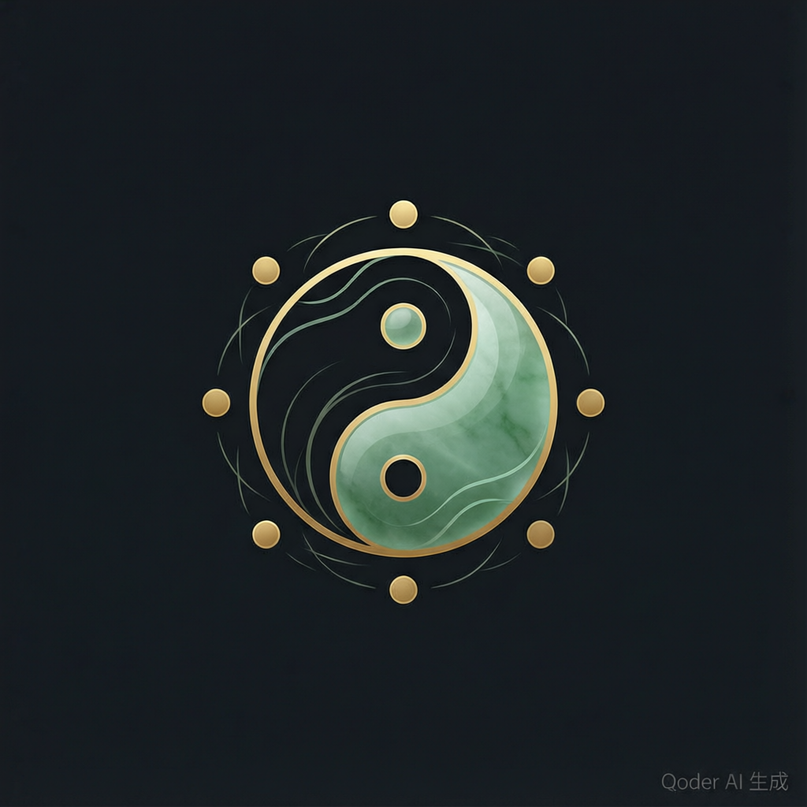

<p align="center">
  
</p>

<h1 align="center">wuyun-liuqi-skills</h1>
<h3 align="center">TCM Yunqi Skills Router</h3>

<p align="center"><em style="font-family: KaiTi, STKaiti, SimSun, serif; font-size: 1.2em; color: #777;">Heaven-Human Oneness · Five Movements &amp; Six Qi</em></p>

<p align="center">
  <a href="https://github.com/dhicoc/wuyun-liuqi-skills/stargazers"></a>
  <a href="https://github.com/dhicoc/wuyun-liuqi-skills/forks"></a>
  <a href="https://github.com/dhicoc/wuyun-liuqi-skills/issues"></a>
  <a href="LICENSE"></a>
</p>

<p align="center">
  AI auto-routing + deterministic calculation engine + RAG knowledge base + self-evolving journal<br/>
  Supports Claude Code / Cursor / Codex CLI / Cline / OpenClaw
</p>

<br/>

<p align="center">
  <a href="#what-is-this">What</a> ·
  <a href="#who-is-it-for">Who</a> ·
  <a href="#quick-start">Quick Start</a> ·
  <a href="#core-capabilities">Capabilities</a> ·
  <a href="#project-structure">Structure</a> ·
  <a href="#contributing">Contributing</a>
</p>

<p align="center">
  🌐 <a href="README.md">中文</a>
</p>

<br/>

---

<a id="what-is-this"></a>

## What is this

> **If you are an AI Agent, jump to [README_AI.md](README_AI.md) and follow the instructions strictly.**

When a user says "How's this year's Yunqi?" or "How did historical physicians treat headache?" to an AI Agent (Claude, Cursor, Codex), this skill pack routes the Agent to a deterministic calculation engine, retrieves relevant pathogenesis from 1994 real case records, and explains it in plain language - instead of hallucinating from memory.

```
User question (natural language)
  -> routing.yaml route matching
  -> calculate_yunqi_api.py calculation engine (Dahan boundary, no hallucination)
  -> rag_search across 37 RAG assets (1994 cases + 33 disease susceptibility)
  -> infer_pathogenesis reasoning chain
  -> plain-language explanation + disclaimer
  -> self_evolve auto-journaling
```

### Current status

| RAG assets | Case records | Public-domain texts | Distilled guides | Scripts | CI tests |
|---:|---:|---:|---:|---:|---:|
| 37 | 1994 | 51 | 12 | 53 | 40 passing |

The routing core is driven by a single `routing.yaml`, auto-discovered by cross-tool shells, with calculation engine and knowledge base kept separate.

<p align="right">(<a href="#what-is-this">back to top</a>)</p>

## What is this

A skill pack that makes AI Agents truly "understand" WuYun-LiuQi (Five Movements and Six Qi). Once installed, just say "How's this year's Yunqi?" in Claude / Cursor / Codex - the Agent calls a deterministic calculation engine to compute the Ganzhi, Dayun, Sitian/Zaiquan, and Kezhu-Jialin, then retrieves relevant pathogenesis and treatment from 1994 real case records across 21 public-domain classics, and explains it in plain language - instead of hallucinating from memory.

**Three pain points it solves:**

1. **LLMs miscalculate Yunqi** - Ganzhi, Sitian/Zaiquan, and Kezhu-Jialin have strict rules that LLMs often get wrong from memory. This pack uses a Python/JS dual-engine for deterministic calculation with Dahan (Major Cold) as the year boundary; results are reproducible.
2. **Yunqi knowledge is scattered and hard to learn** - the system is complex, data-heavy, and spread across classics. This pack distills 51 public-domain texts (1.77M characters) into Greppable structured guides, plus a 700-term glossary.
3. **No reliable Agent skill pack exists** - there's almost no Yunqi skill designed for Agents. This pack provides a routing contract, ReAct workflow, and self-evolution loop out of the box.

> ⚠️ Yunqi is traditional Chinese medicine theory. This pack is for learning, research, and assisted reasoning only - it is not a medical diagnosis or treatment system. Clinical decisions must be made by licensed physicians.

## Who is it for

- **TCM students / researchers** - need accurate calculation of a given year/step's Yunqi pattern and retrieval of historical clinical experience
- **AI application developers** - want to add a reliable Yunqi capability to an Agent without building from scratch
- **Yunqi enthusiasts** - want to understand ideas like Heaven-Human Oneness, Qi transformation, and moderation through natural conversation rather than memorizing tables

## Quick Start

### One-line install (recommended)

Send this message directly to Claude (or any skill-capable AI):

```text
Repo: https://github.com/dhicoc/wuyun-liuqi-skills.git

Please install the WuYun-LiuQi skill pack per workflows/one-line-install.md:
clone the repo, run `python scripts/install.py --link-global`, and verify.
```

The AI will: clone -> register global skill -> verify. Afterwards, say "WuYun-LiuQi" in any project to activate it.

### Manual install

```bash
# 1. Clone
git clone https://github.com/dhicoc/wuyun-liuqi-skills.git
cd wuyun-liuqi-skills

# 2. Python deps (only lunar-python, for precise solar-term calc)
pip install -r requirements.txt

# 3. Optional: Node.js interface deps
npm install

# 4. Register global skill (auto-discovered by Claude / Cursor)
python scripts/install.py --link-global
```

Requirements: Python 3.8+ / Node.js 14+.

### 30-second verification

```bash
# Calculate today's Yunqi
python scripts/calculate_yunqi_api.py today --summary

# Deep explanation of a concept
python scripts/calculate_yunqi_api.py today --level deep --explain-concept "天人合一"

# Search case records
python scripts/rag_search.py 头痛 --asset asset26,asset27
```

### Activation methods

| Scenario | How | Best for |
|----------|-----|----------|
| Use in this repo | Open the `wuyun-liuqi-skills` folder with Cursor / Claude | Trial, evaluation |
| Use in any project | `python scripts/install.py --link-global` | Daily use (recommended) |
| Claude Code plugin | `/plugin marketplace add dhicoc/wuyun-liuqi-skills` -> `/plugin install wuyun-liuqi-skills@wuyun-liuqi-skills` | Claude Code users |

Once configured, just talk to the Agent:

- "What does this year's Yunqi suggest for wellness?"
- "How does my birth year's Yunqi pattern relate to my constitution?"
- "Explain Sitian/Zaiquan in simple terms"
- "How did historical physicians treat headache? Compare Sun Yikui and Ye Tianshi"

## Core capabilities

### 🔮 Deterministic calculation engine

Ganzhi · Dayun excess/deficiency · Sitian/Zaiquan · Kezhu-Jialin six steps · Pingqi · Tianfu-Suihui. Python primary path + optional JS interface, dual-engine consistency check, Dahan year boundary, trustworthy results.

```bash
python scripts/calculate_yunqi_api.py today --json    # Agent / JSON interface
python scripts/calculate_yunqi_api.py 2026-06-27 --summary
```

### 📚 1994 real case records · 21 public-domain classics

Distilled verbatim from Wikisource public-domain originals - zero placeholders, zero fabrication, each case carries a `source_quote` attestation. Covers Mingyi Lei'an, Xu Mingyi Lei'an, Gujin Yi'an An, Ding Ganren, Shanghan Jiushi Lun, Linzheng Zhinan, Huichun Lu, Zhang Yuqing, Wu Jutong, Yuyi Cao, Huixi, Huayun Lou, Xingxuan (184 cases), Sun Wenyuan (390 cases), and more - 21 collections in total.

### 🔍 Multi-dimensional retrieval

| Method | Example |
|--------|---------|
| Keyword search | `rag_search.py 头痛` |
| Cross-library search | `rag_search.py 头痛 --asset asset26,asset27` |
| Field-precise search | `rag_search.py --field herbs 石膏` |
| Colloquial semantic search | `rag_search.py --semantic 心火偏旺` |
| Case comparison | `case_relations.py --compare 孙一奎,叶桂 --tag 中风` |
| Similar case discovery | `case_relations.py --related swy_174` |

### 🧠 Agent self-evolution fallback

When tools can't answer, the Agent neither refuses nor fabricates - it: searches the web -> summarizes with source + disclaimer -> deposits the experience into `case-journal/field-journal/` -> prioritizes the experience library next time. Gets smarter with use.

### 📖 Five-layer commentary chain (public-domain distilled guides)

| Layer | Guide | Source | What it answers |
|-------|-------|--------|-----------------|
| Formula | `sanyin_sitianfang_guide.md` | Chen Wuze, *Sanyi Jiyi* | Which formula, six-step modifications |
| Textbook | `yunqi_yaojue_pathogenesis_guide.md` | Wu Qian, *Yunqi Yaojue* | Pathogenesis mnemonic, standard phrasing |
| Pathogenesis | `sujwen_xuanji_pathogenesis_guide.md` | Liu Wansu, *Suwen Xuanji Yuanbing Shi* | Symptom-by-symptom pathogenesis |
| Ontology | `leijing_tuyi_yunqi_philosophy_guide.md` | Zhang Jiebin, *Leijing Tuyi* | Taiji-Yin-Yang-Wuxing ontology |
| Treatment | `baoming_zhifa_guide.md` | Liu Wansu, *Baoming Ji* | 19-item pathogenesis treatment principles |

All zero-dependency - Agent just Greps + Reads.

### 🎭 Commentator perspective skills

Liu Wansu (Cold-Cool school) and Zhang Jiebin (Warm-Tonify school) are built into runnable perspective skills. When activated, the Agent switches to the commentator's viewpoint rather than "speaking for" them. Both originals are Greppable, forming the sharpest doctrinal contrast in Yunqi history.

### 🏥 Medical safety boundary

- All clinical output must carry a disclaimer
- Yunqi theory analysis ≠ medical advice; the latter must recommend seeing a doctor
- Formulas labeled "reference formula, requires pattern-differentiation modification"
- No specific dosages are given

## Complete feature list

> 53 scripts · 6 sub-skill modules · 10 teaching modules · 2 commentator perspectives · 37 RAG assets · 51 public-domain texts · 12 distilled guides

### Calculation engine (9)

| Feature | Entry script | Description |
|---------|--------------|-------------|
| Unified calc (main path) | `calculate_yunqi_api.py` | Dahan year boundary + Ganzhi/Dayun/Zhuyun-Keyun/Sitian-Zaiquan/Kezhu-Jialin, outputs JSON + rag_keys |
| JS interface | `calculate_yunqi_api.js` | For frontend/Node integration; dual-engine consistency with Python |
| Aggregator CLI | `yunqi_cli.py` | Unified entry: calc/report/map/learn/search/dashboard |
| Py/JS consistency check | `compare_py_js_yunqi.py` | Cross-language key-field comparison |
| Pathogenesis reasoning chain | `infer_pathogenesis.py` | Suiyun pathogenesis -> Sitian/Zaiquan -> six steps -> recommended formulas |
| Weather alignment | `weather_alignment.py` | Real weather × Yunqi pattern (Open-Meteo, `--mock` for testing) |
| Weather × constitution | `yunqi_weather_constitution.py` | Birth constitution × current Suiyun × weather 3D analysis |
| Unified advanced alignment | `advanced_alignment.py` | Base Yunqi + constitution + 9-constitution score + weather alignment |
| Personal Yunqi profile | `personal_yunqi_profile.py` | Birth-year Yunqi pattern + constitution tendency + wellness direction |

### Knowledge retrieval (5)

| Feature | Entry script | Description |
|---------|--------------|-------------|
| RAG multi-dimensional search | `rag_search.py` | Keyword / `--key` exact / `--date` by day / `--field` / `--asset` multi-lib / `--semantic` |
| Lightweight semantic search | `rag_semantic.py` | Character n-gram semantic matching, no vector DB needed |
| Case relation graph | `case_relations.py` | Cross-physician compare `--compare` + similar case discovery `--related` |
| Structured field extraction | `extract_structured_fields.py` | Extract herbs + formulas_referenced fields |
| Literature ingestion | `ingest_literature.py` | Ingest new literature into the RAG knowledge base |

### Citation & progressive loading (new)

| Feature | Entry script | Description |
|---------|--------------|-------------|
| Stable citation resolve | `resolve_ref.py` | `yle:<asset>:<entry_id>` reverse-lookup + accessibility gate (`--selfcheck`) |
| Progressive case routing | `cases_routing.py` | Per-syndrome/per-yunqi primary+supplement+force checklist, load-on-demand |
| Glyph normalization | `rag_search.py` (built-in) | Variant/traditional ↔ simplified interchange (~70 items), better vernacular recall |
| Term ambiguity display | `rag_search.py --show-terms` | Show raw → normalized → synonym OR-group |
| Two-stage extra search | `rag_search.py --include-extra` | Follow-up wider OR search on normalized core terms (off by default) |

### Reports & export (6)

| Feature | Entry script | Description |
|---------|--------------|-------------|
| Annual report | `yunqi_report.py` | Student/practitioner/researcher Markdown report, optional advanced-alignment section |
| HTML visual report | `generate_html_report.py` | Ink-wash design system, dark-screen/light-print dual mode |
| Thought export | `export_thought.py` | Plain-text summary / Anki cards (TSV+MD) / printable HTML/PDF |
| Thought map | `export_thought_map.py` | Mermaid concept map + year-structure diagram |
| Yunqi timeline | `visualize_timeline.py` | Annual six-step timeline HTML |
| Case browser | `generate_case_browser.py` | 1994-case visual browser HTML |

### Learning & teaching (3)

| Feature | Entry script | Description |
|---------|--------------|-------------|
| Socratic learning session | `socratic_learn.py` | Question-driven guided learning, progressive depth |
| Learning dashboard | `learning_dashboard.py` | Concept coverage + artifact tracking + next-step recommendation |
| Full-chain demo | `demo_full_chain.py` | Calc -> search -> pathogenesis -> report end-to-end demo |

### Self-evolution & ops (7)

| Feature | Entry script | Description |
|---------|--------------|-------------|
| Self-evolution engine | `self_evolve.py` | Logging / feedback / blind-spot detection / monthly report / cleanup / suggestions |
| Health check | `health_check.py` | Dependency, path, config integrity check |
| Knowledge-base validation | `validate_knowledge_base.py` | 37 asset JSON schema validation |
| RAG index generation | `generate_rag_index.py` | Generate / refresh RAG search index |
| Report quality gate | `report_quality_gate.py` | Pre-output quality validation |
| Routing sync | `sync_routing.py` | Sync routing.yaml changes to all entry files |
| Clinical safety check | `clinical_safety.py` | Clinical-output disclaimer compliance check |

### Install & validation (6)

| Feature | Entry script | Description |
|---------|--------------|-------------|
| Installer | `install.py` | `--link-global` registers global skill (Claude/Cursor auto-discovery) |
| Conformance check | `check_conformance.py` | conformance.yaml config consistency |
| Routing scenario test | `check_routing_scenarios.py` | routing.yaml routing-hit regression |
| Skill structure check | `check_skill_structure.py` | SKILL.md / routing.yaml structural integrity |
| Orphan file audit | `audit_orphans.py` | Scan for files not referenced by routing |
| Full-chain smoke test | `smoke_full_chain.py` | Quick end-to-end smoke |

### Sub-skill modules (6, routing.yaml targets)

| Module | Directory | Coverage |
|--------|-----------|----------|
| Ganzhi basics | `modules/ganzhi-basics/` | Heavenly stems/earthly branches, sexagenary cycle, zodiac, solar terms & Yunqi |
| Yunqi calculation | `modules/yunqi-calc/` | Dayun excess/deficiency, Zhuyun-Keyun five steps, Sitian/Zaiquan, Kezhu-Jialin, Pingqi, Tianfu-Suihui |
| Pathogenesis | `modules/yunqi-pathogenesis/` | Five-movement & six-qi pathogenesis, combined Yunqi disease |
| Clinical application | `modules/yunqi-clinical/` | Treatment principles, Sanyi Sitian formulas, acupuncture, wellness (with disclaimer) |
| Classical literature | `modules/yunqi-classics/` | Suwen seven treatises, historical schools, modern research index |
| Report generation | `modules/docs-generator/` | Student/practitioner/researcher report templates |

### Knowledge-base assets

| Category | Count | Description |
|----------|-------|-------------|
| RAG key-value assets | 37 | Pathogenesis/formulas/commentaries/region/constitution/agediagram cases/epidemic/21 historical case collections |
| Public-domain texts | 51 | ~1.77M characters, pre-Qin to Qing; includes Suwen seven treatises, lost chapters, Shengji agediagrams, Xuanzhu Miyu |
| Distilled guides | 12 | Five-layer commentary chain (5) + 35-text merged groups (5) + supplements; Grep+Read, zero-dep |
| Terminology glossary | 700 | `terminology.json`, matched via rag_keys |
| Total historical cases | 1994 | 21 public-domain case libraries, with herbs + formulas_referenced structured fields |

### Teaching modules (10 concepts)

Each concept in `teaching-modules/` is a five-part module (original text / commentator / interpretation / key quote / misconceptions / depth layers):

Heaven-Human Oneness · Qi transformation · Moderation · Dayun-Suiyun · Five-movement progression · Excess/deficiency · Pingqi · Sitian/Zaiquan · Kezhu-Jialin · Tianfu-Suihui

### Commentator perspectives (2)

| Perspective | Commentator | School | Core stance |
|-------------|-------------|--------|-------------|
| `perspectives/liu-wansu-perspective/` | Liu Wansu (Jin) | Cold-Cool | Six Qi all transform into Fire; avoid drastic warm/acrid; concurrent-transformation is deficiency |
| `perspectives/zhang-jiebin-perspective/` | Zhang Jiebin (Ming) | Warm-Tonify | Yang Qi is the root; five-phases mutual containment; generation contains restraint |

### Advanced alignment

| Capability | Description |
|------------|-------------|
| Weather × Yunqi | Real weather (Open-Meteo) × Yunqi pattern - internal/external pathogen harmony/conflict |
| Constitution × Yunqi | 9-constitution score × birth Yunqi pattern × current Suiyun wellness direction |
| Regional modifier | Eight climate zones regional correction factor |
| 3D overlay | Birth constitution × current Suiyun × weather unified analysis |

### CI / continuous integration

- GitHub Actions matrix: Python 3.10/3.11/3.12 + Node 18/20/22
- 22 full-chain tests: validate · index · conformance · routing · regression · e2e · scenario · random-chain
- All CI-equivalent tests must pass locally before every push

## Project structure

```
.
├── SKILL.md                    # ★ Master routing entry (AI must-read)
├── routing.yaml / routing.md   # ★ Routing source of truth / human index
├── AGENTS.md / CLAUDE.md       # Cross-tool thin shell (Codex / Claude)
├── scripts/                    # 53 Python scripts + JS interface
│   ├── calculate_yunqi_api.py  #   ★ Main path (Dahan boundary + rag_keys)
│   ├── rag_search.py           #   ★ RAG search
│   ├── case_relations.py       #   Case compare / similar discovery
│   ├── personal_yunqi_profile.py #   Personal constitution
│   ├── self_evolve.py          #   Self-evolution engine
│   └── …                       #   Report/export/validation/etc.
├── wuyun_liuqi/                # Importable Python package
├── rag-knowledge-base/         # ★ 37 assets + distilled guides + literature
│   ├── asset1-37 *.json        #   Pathogenesis/formula/commentary/case (21 libraries)
│   ├── *_guide.md              #   10 public-domain distilled guides
│   └── literature/             #   51 public-domain texts (1.77M chars)
├── modules/                    # Sub-skills (routing.yaml targets)
│   ├── ganzhi-basics/          #   Ganzhi basics
│   ├── yunqi-calc/             #   Yunqi calculation (core)
│   ├── yunqi-pathogenesis/     #   Pathogenesis
│   ├── yunqi-clinical/         #   Clinical application
│   ├── yunqi-classics/         #   Classical literature
│   └── docs-generator/         #   Report generation
├── perspectives/               # Commentator personas (Liu Wansu / Zhang Jiebin)
├── rules/                      # medical-safety / calculation / agent-behavior
├── workflows/                  # bootstrap / routing-contract / task-closure
├── prompts/                    # system_prompt + expression_style
├── case-journal/               # Case records
├── tests/                      # Full regression (22 CI tests)
└── .github/workflows/          # CI (Python 3.10/3.11/3.12 + Node 18/20/22)
```

## Verification

```bash
python scripts/health_check.py
python scripts/validate_knowledge_base.py
python tests/full_regression_test.py   # 22 CI-equivalent tests
```

All CI-equivalent tests must pass locally before every push.

## Contributing

Contributions welcome - Fork -> feature branch -> PR. Please read [CONTRIBUTING.md](CONTRIBUTING.md) first.

```bash
git checkout -b feature/your-feature
git commit -m "Add your feature"
git push origin feature/your-feature
# Open a Pull Request
```

## License

MIT License - see [LICENSE](LICENSE).

### Acknowledgements

- Architecture inspired by [reverse-skill](https://github.com/zhaoxuya520/reverse-skill)
- Theoretical basis: *Huangdi Neijing Suwen* seven major treatises
- AI community: [linux.do](https://linux.do)
